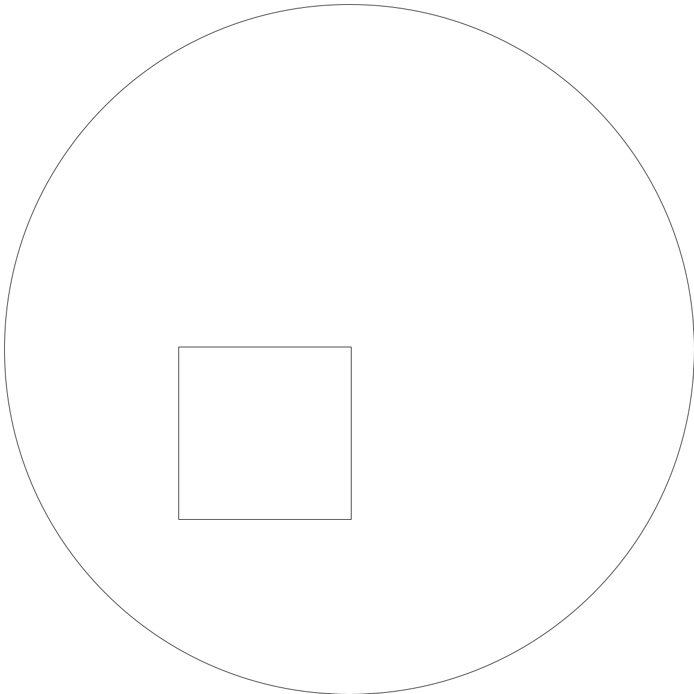
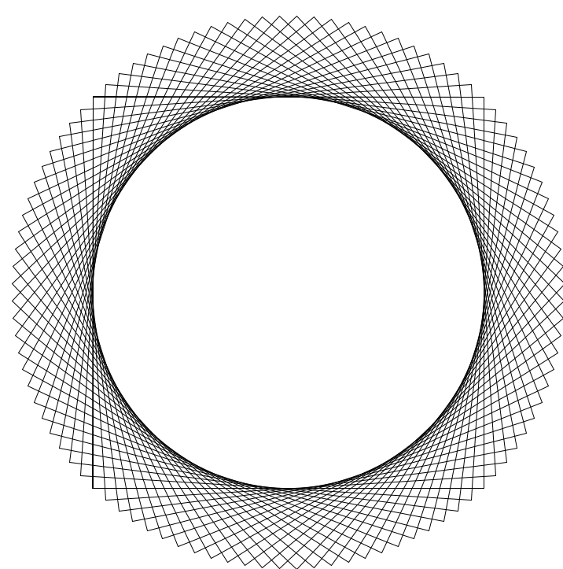

## Project \# 2: Lettuce With Figs 

::::{.columns}
::: {.column width="60%"}
  - Implement a DSL for 2D Graphics
  - Inspired by the Haskell Diagrams Library
    - [https://diagrams.github.io/](https://diagrams.github.io/)
:::
::: {.column width="40%"}
{width=80%}
:::
::::

## Example \# 1

```ml 
let x = 41 in (* set x to 41 *)
  let f = rectangle(x) in 
    (* f is a rectangle of width 41 and height 41 *)
    let g = circle(2 * x) in 
      (* g is a circle of radius 82 *)
      (* translate f by (-20, -20) and overlay g on it *)
      ((f -> [-20, -20]) ~ g) 
```
results in 

{width=70%}

## Example \# 2

```ml
     let p = rectangle(1) in 
      let q = circle(5) in
        let N = 25 in
          letrec f = function (n) (
            let ang = 2*3.1415* n/N in
	     let q = (p // ang) in 
               if n == 0
               then q
               else  q ~ f(n-1)
          )
         in f(N) 
```
results in 

{width=100%}

## Project Details

- Extension of lettuce language with datatypes that represent 2D figures

- Figures are made up as follows:
   - Primitive Figures: Circle, Rectangle, Triangle
   - Composite Figures: 
      - Translation
      - Rotation
      - Reflection
      - Scaling
      - Overlaying
      - Place one figure to left of another 
      - Place one figure above another

## Project Part \# 1 

- Implement the missing portions of MyCanvas.scala

- A canvas is a list of figures.
    - Each figure can be a circle or a polygon. 

- Read documentation for details of 
    - Bounding boxes for figures.
    - Transformations on figures.
    - Implement the missing methods according to specifications. 


## Project Part \# 2

- Implement the interpreter for the extended lettuce language.
   - Extend the AST to include new constructs for figures and transformations.
   - Implement the evaluation function to handle new constructs.
   - Ensure that the interpreter correctly applies transformations and combines figures as specified.

- Test the interpreter with various lettuce programs to ensure correctness.

